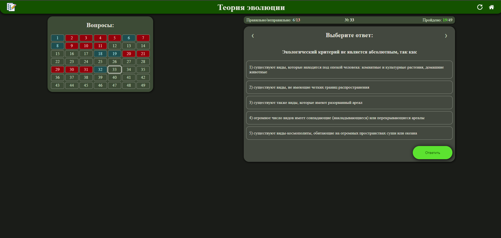
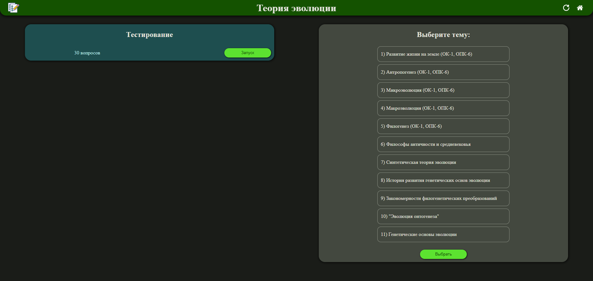
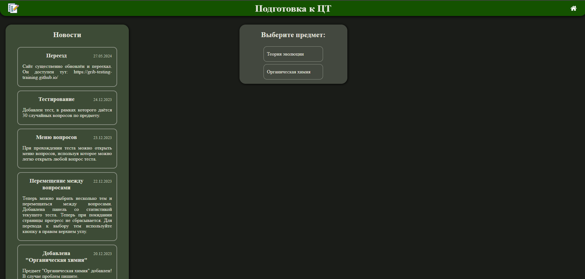
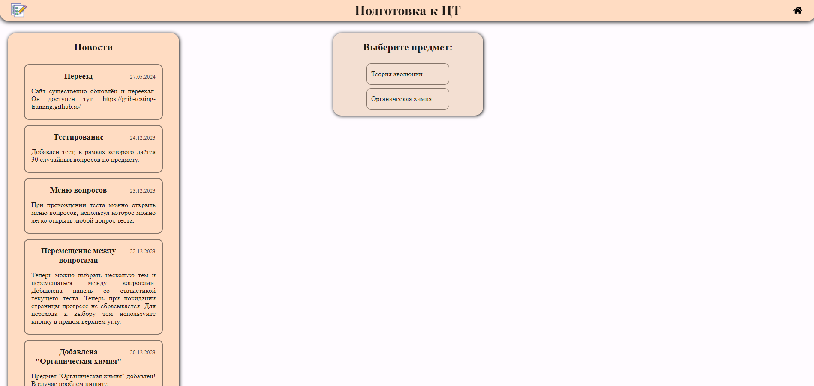

# Preparing for centralized testing

Tasks from centralized testing of I.M. Sechenov First Moscow State Medical University (Sechenov University)
(First Moscow State Medical University, Sechenov University).
Assignments from an open bank in a form convenient for learning.
At the moment, this version of the site is outdated.
New version: [testing_training](https://github.com/grib-testing-training/testing_training).

## Features

1. Site development news
2. Test (30 questions on the subject)
3. Breakdown of questions by topic
4. Transition between questions, field with all questions
5. Current test statistics
6. Choose a light or dark theme
7. Choose a color theme

## Screenshots

## Technologies

- HTML
- CSS
- JS
- Python-scripts for getting JSON from tables