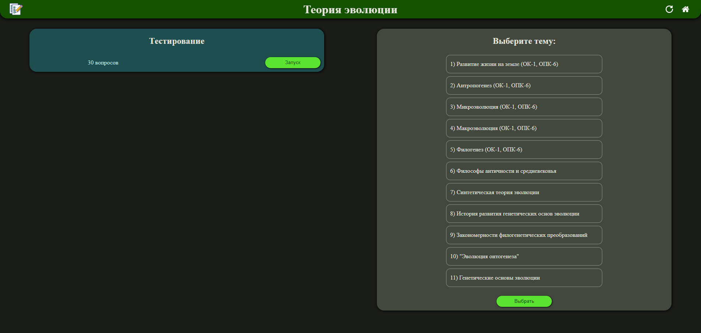
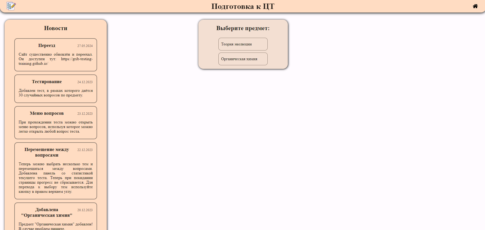

# Подготовка к ЦТ

Задания из централизованных тестирований Первого Московского государственного медицинского университета имени И. М.
Сеченова (Первый МГМУ им. И. М. Сеченова, Сеченовский университет).
Задания из открытого банка в удобной для заучивания форме.
На данный момент данная версия сайта является устаревшей.
Новая версия: [testing_training](https://github.com/grib-testing-training/testing_training).

## Фишки

1. Новости развития сайта
2. Режим тестирования (30 вопросов по предмету)
3. Разбиение вопросов по темам
4. Переход между вопросами, поле со всеми вопросами
5. Статистика теста
6. Выбор светлой или тёмной темы
7. Выбор цветовой темы

## Скриншоты

## Технологии

- HTML
- CSS
- JS
- Python-скрипты для получения JSON из таблиц